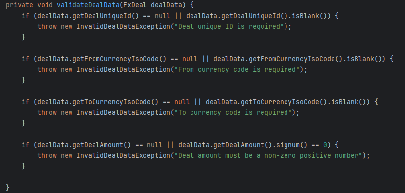
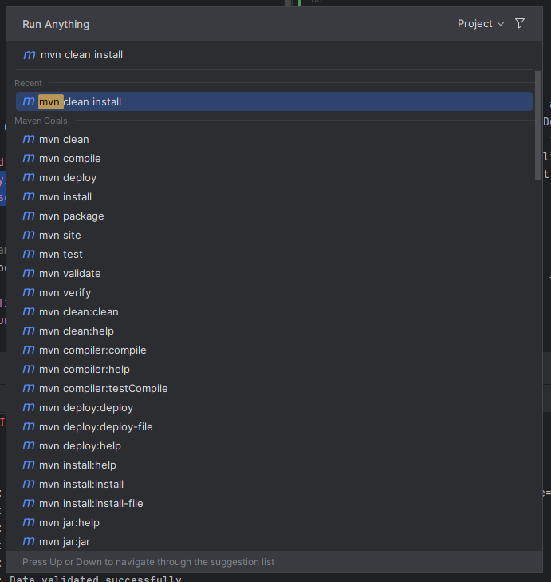
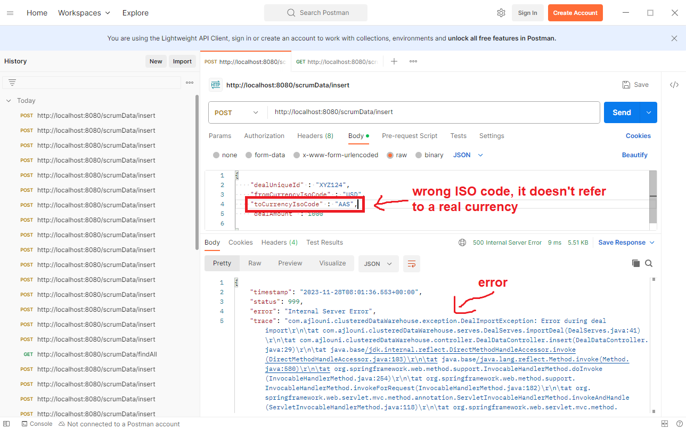
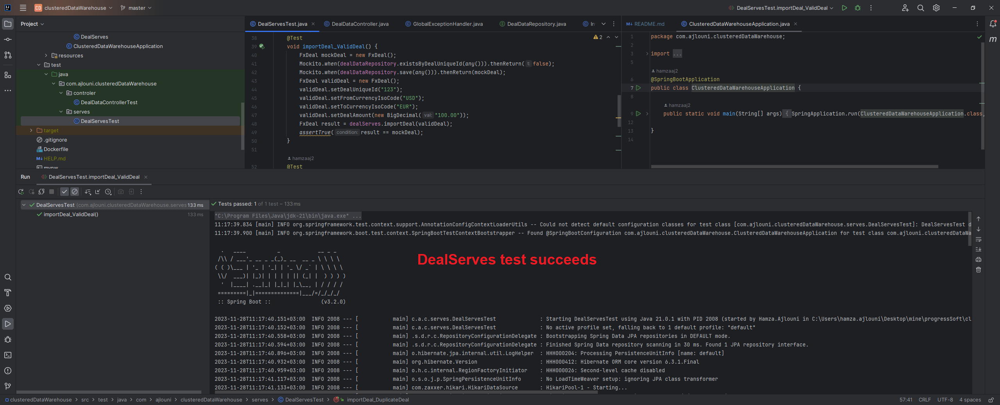

# Clustered Data Warehouse

This is a Spring Boot application for a clustered data warehouse system.

## Requirements

To run the application, ensure you have the following prerequisites installed:

- Java 17
- Maven
- Docker
- Docker Compose

## How to Run

1. Build the application using Maven:
   ```bash
   mvn clean install
2. Run the application
3. Access the APIs using tools like Postman.

## System Components

1. mysql
2. GitHub

## Code Structure and Implementation Details

- Project Initialization

The project is initialized using the Spring Initializer to set up Maven, specify the programming language, version, and add necessary dependencies.


1. FxDeal Class: A class named FxDeal is created to encapsulate the data to be added to the database. The table in the database is named after this class.
   

2. Controller: The code begins with a controller where you can request insert and findAll APIs. For findAll, it retrieves the list of data from the database, and for insertion, it adds data to the database.
   
   
   

3. Data Validation Steps:
   
- First step: Validation for missing inputs to ensure correct input.
   
- Second step: Validation for duplication.
- Third step: Validation for ISO code.
   

4. Automatic Data Addition:

- The system automatically adds certain data such as time and ID during the processing.

5. Logging and Error Handling:

- Comprehensive logging is implemented to track system activities.
- Robust error handling is in place for better understanding and debugging.

6. Unit Testing:

- Unit tests are incorporated to validate the functionality of the code.

7. Docker Integration:

- Docker is integrated into the project for containerization.

## Run Simulation

In this section, the code and its functionality are explained, followed by a real example.


1. Database Connection:
- A local database is created and connected to the project.

2. Maven clean install
   

3. Run the project
   

4. call insert API
   
   

5. test some cases
- missing field
  
  

- duplicated ID
  
  

- Wrong ISO code
  
  

6. Insert new Data
   

7. Show the database in MySQL
   

8. call findAll API
   

9. Testing:

- Unit testing for controller
  

- Unit testing for DealServes
  

  
I hope everything is clear in the project